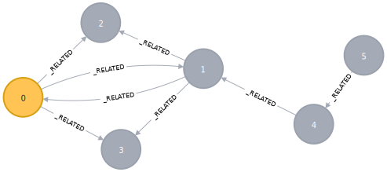

# k-hop!
> No, not _k-pop_...**k-hop**!

Given the following graph:



The _2-hop_ subgraph with origin `0` looks like (sorting edges for readability):

```json
[
  [0, 1], [0, 2], [0, 3],
  [1, 2], [1, 3], [1, 0],
  [4, 1]
]
```

Even simpler, for node `5`: `[[5, 4] [4, 1]]`

To construct it quickly with Cypher:

```cypher
CREATE (n0)<-[:FOLLOWS]-(n2)<-[:FOLLOWS]-(n0)-[:FOLLOWS]->()<-[:FOLLOWS]-(n2)-[:FOLLOWS]->()<-[:FOLLOWS]-(n0),
  (n2)-[:FOLLOWS]->()-[:FOLLOWS]->()
MATCH (n) SET n:User
```

## neo4j_arrow & k-hop

For now, k-hop jobs piggyback on _GDS Read_ jobs until they get their own
messages, but the `neo4j_arrow.py` client exposes a dedicated method to make it
easy:

```python

from src.main.neo4j_arrow import neo4j_arrow as na

client = na.Neo4jArrow('neo4j', 'password', (HOST, 9999))
ticket = client.khop('mygraph')
```

Let's walk through using the above sample graph!

### Step 0: Slight of Hand
We need a relationship property available, but it technically doesn't need to
even exist. Assuming you have Neo4j 4.3 or newer, just create an index like so:

```cypher
CREATE INDEX FOR ()-[r:FOLLOWS]->() ON (r._type_);
```

> See the section towards the bottom, [Edge Packing](#Edge-Packing), for how
> this encoded value is used.

### Step 1: Project the Graph

The current 2-hop implementation requires a directed _graph projection_ that 
encodes some metadata in the relationship property. For our example graph, use
the following:

```cypher
CALL gds.graph.create('sample', 'User', {
    FOLLOWS: { properties: ['_type_'] },  // our relationship property!
    FOLLOWS_REV: { 
        type: "FOLLOWS",
        orientation: "REVERSE",
        properties: { _type_: { defaultValue: 1.0 } } // we flag reversed edges
    }
});
```

### Step 2: Connect to `neo4j-arrow`

Graph Python and install PyArrow (v5 or newer). Then create your client using
the project's [neo4j_arrow.py](src/main/neo4j_arrow/neo4j_arrow.py) client/wrapper:

```python

from src.main.neo4j_arrow import neo4j_arrow as na

client = na.Neo4jArrow('neo4j', 'password', ('localhost', 9999))
```

> replace `localhost` with the appropriate ip or hostname for the neo4j system

### Step 3: Submit the k-hop job

For this part, we'll assume we're using the `neo4j` database.

```python
ticket = client.khop('sample', database='neo4j')
```

### Step 4: Consume the Results

We've got a small set here, but if we had batches we'd iterate over the stream:

```python
import pprint

for (batch, _) in client.stream(t):
    pprint.pp(batch.to_py())
```

Results in:

```python
{'_origin_id_': [0],
 '_source_ids_': [[0, 1, 1, 1, 4, 0, 0]],
 '_target_ids_': [[1, 0, 2, 3, 1, 2, 3]]}
{'_origin_id_': [1],
 '_source_ids_': [[1, 0, 0, 0, 1, 1, 4, 5]],
 '_target_ids_': [[0, 1, 2, 3, 2, 3, 1, 4]]}
{'_origin_id_': [2],
 '_source_ids_': [[0, 0, 0, 1, 1, 1, 4]],
 '_target_ids_': [[1, 2, 3, 0, 2, 3, 1]]}
{'_origin_id_': [3],
 '_source_ids_': [[0, 0, 0, 1, 1, 1, 4]],
 '_target_ids_': [[1, 2, 3, 0, 2, 3, 1]]}
{'_origin_id_': [4],
 '_source_ids_': [[4, 1, 1, 1, 0, 5]],
 '_target_ids_': [[1, 0, 2, 3, 1, 4]]}
{'_origin_id_': [5], '_source_ids_': [[5, 4]], '_target_ids_': [[4, 1]]}
```

There are 6 independent vectors each of a single degree. This is to due to the
parallel construction and batching on the server side.

For small result sets, you can use PyArrow's shortcuts like:

```python
t = client.stream(t)
table = client.read_all()
print(table)
```

Resulting in a `pyarrow.Table` instance with the independent batches appended:

```
pyarrow.Table
_origin_id_: int32
_source_ids_: list<uint32: uint32>
  child 0, uint32: uint32
_target_ids_: list<uint32: uint32>
  child 0, uint32: uint32
----
_origin_id_: [[0],[1],[2],[3],[4],[5]]
_source_ids_: [[[0,1,1,1,4,0,0]],[[1,0,0,0,1,1,4,5]],[[0,0,0,1,1,1,4]],[[0,0,0,1,1,1,4]],[[4,1,1,1,0,5]],[[5,4]]]
_target_ids_: [[[1,0,2,3,1,2,3]],[[0,1,2,3,2,3,1,4]],[[1,2,3,0,2,3,1]],[[1,2,3,0,2,3,1]],[[1,0,2,3,1,4]],[[4,1]]]
```

## Runtime Considerations & Scale

The current implementation is specific to `k=2`, i.e. it will _only_ work for a
2-hop job. Some reasons for this follow.

### Supernodes

Supernodes are nodes with a substantially large degree. For this purpose, let's
define them as having `>= 1e5` neighbors. The impact of a supernode on k-hop
expansion is a dramatic increase in the number of edges being output.

Take, for example, a simple graph with the following characteristics:

- `500,001` nodes
  - `500,000` nodes have a `:FOLLOWS` relationship to the sole outlier node
  - that sole outlier doesn't have any outgoing relationships

So the average degree is slightly less than `2`:

```
((1 degree) * (500,000 nodes) + (500,000 degree) * (1 node)) / (500,0001 nodes)
```

*BUT!* any 2-hop from any non-supernode, which you have a `99.99%` chance of
picking at random, will produce `500,001` edges in the result set. So even for
_just_ the 2-hop output from non-supernodes, you're looking at:

```
(500,001 edges) * (500,000 non-supernodes) = 250,000,500,000 edges!
```

And if we assume we can pack an edge into `60 bits` (see my design assumptions
below), that's `~1.875 Terabytes` of data!

## Optimizations in this 2-hop Implementation

A few optimizations were used to get what I'd consider "ok" performance, where
I'd consider "ok" performance to be generating _100-200 complete 2-hop 
subgraph/s on a dense graph with supernodes_.

### Edge Packing

In Neo4j, node ids are Java `long`s, which means they're typically 64-bit
numbers. Since Java uses signed types, that's 63-bits available giving a max
long value of `2^63-1`. Well beyond the realm of a usable graph.

Given a relationship, or edge, is defined primarily by a source node and a
target node, it requires at minimum 128 bits if we were to use Java `long`s.

_And 8 bytes adds up **fast** when you're talking about billions to trillions 
of relationships!_

Instead, if we assume the most amount of nodes in the is just over 1 billion,
we really only need _30 bits_ to represent a node, meaning _60 bits_ for a
relationship. (`2^30 - 1 = 1,073,741,823`)

The remaining 4 bits can be used as follows:

- `1 bit` to indicate the projection orientation: `1 = natural, 0 = reversed`
- `3 bits` to encode a relationship type for faster retrieval, leaving us the
   possibility of encoding up to `8 types` _or increasing node capacity_

The best part is a single `long` primitive can be used for all the above while
reducing memory footprint, Objects on the JVM heap, etc. A stream of edges can
be represented as a Java `java.util.stream.LongStream` as well.

## Traversal Optimizations

A 2-hop subgraph is effectively the _unique set of all edges_ of all 
_neighbors_ of a given _origin_ node.

So given a node `O`, for every neighbor `n`, we collect the set of all
relationships into or out of `n`. This will include `O`, since `n` is a
neighbor.

The harder part is _de-duplicating_ or finding the intersection of the sets.

Instead of dealing in terms of edges, which as we previously stated are
_64 bits_ of data, all we really need to track are _node ids_...which we
already said are only **30 bits** of information.

Why just node ids? There are effectively only 2 filtering conditions:

### Filtering from the Origin (k=1)

During initial traversal (`k=1`) from the origin `O`, we simply need to track 
if we see the same neighbor _twice_. Then for all edges we find that connect
`O` to its neighbors, we drop any that aren't `NATURAL` _OR_ seen twice.

This accounts for situations like in the sample graph where node `0` and node
`1` share parallel edges. Since we know we're doing a `2-hop`, we know that the
neighbor in question `n` will have the _natural_ form of the edge we're
dropping!

### The Final Filter

Lastly, after we assemble all the sets of edges from neighbors, we filter out
any that are _not `NATURAL`_ OR have a _target_ that is _not a neighbor or `O`
itself_.

This catches any nodes a full 2-hops away from the origin `O` but don't have a
direct relationship to `O`.

> Note: after filtering we still need to deal with any edges that are `REVERSE`
> orientation and for that see the next section.

## Dealing with Orientation in GDS

GDS graph projections create adjacency lists that are always the _outgoing_
relationships from a given node. In order to "traverse" logically from a node
and be able to follow _any_ relationship, we need effectively need an
undirected graph.

This explains the sleight of hand demonstrated by the projection in
[Step 1: Project the Graph](Step-1:-Project-the-Graph) above.

The catch is one does not have access to type information directly while
traversing a GDS graph, at least not without computational cost!

Instead we leverage the relationship property (`_type_` above) to encode if the 
relationship is `NATURAL` (`_type_ = null or NaN`) or `REVERSE`
(`_type_ = 1.0`). We can inspect the property via the relationship cursor in
GDS during traversal and ascertain the __true orientation__ of the edge.
